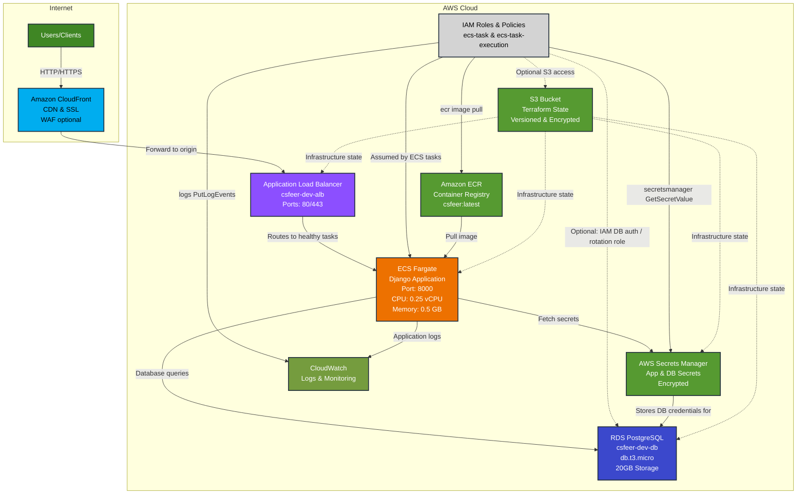

# CSFeer AWS Infrastructure - Big Picture

## Core Architecture



## Key Components

### 🚀 **ECS Fargate** (Main Application)
- **Service**: Runs Django application in containers
- **Scaling**: Auto-scalable, starts with 1 task
- **Resources**: 0.25 vCPU, 0.5 GB RAM per task
- **Health**: `/ready/` endpoint checks database connectivity

### 🏗️ **Application Load Balancer** (Traffic Router)
- **Purpose**: Routes HTTP/HTTPS traffic to healthy ECS tasks
- **Ports**: 80 (HTTP), 443 (HTTPS optional)
- **Health Checks**: Validates ECS task health
- **Location**: Public subnets with internet access

### ☁️ **Amazon CloudFront** (CDN & Edge Protection)
- **Purpose**: Global CDN in front of the ALB for caching, DDoS protection, and edge SSL termination
- **Origin**: Configured to use the ALB as the origin (cache miss / dynamic content forwarded to ALB)
- **Security**: Use ACM certificates for TLS (note: public certs must be in `us-east-1` for CloudFront) and integrate AWS WAF if desired
- **Benefits**: Reduced latency, offload traffic from ALB/ECS, ability to block malicious traffic at edge (WAF)
- **Notes**: For S3-backed static assets you can optionally configure CloudFront to use an S3 origin or restrict access with OAI/user policies.

### 🗄️ **RDS PostgreSQL** (Database)
- **Instance**: db.t3.micro (free tier eligible)
- **Storage**: 20GB, encrypted, auto-scaling available
- **Location**: Private subnets (no direct internet access)
- **Backup**: Automated backups with configurable retention

### 📦 **ECR** (Container Registry)
- **Purpose**: Stores Docker images for the application
- **Tags**: `latest`, environment-specific, git commit SHAs
- **Security**: Integrated with IAM for access control

### 🪣 **S3** (State Storage)
- **Purpose**: Stores Terraform infrastructure state
- **Features**: Versioning, encryption, access logging
- **Files**: Separate state files for RDS, ECS, Keycloak components

### 📊 **CloudWatch** (Monitoring)
- **Logs**: Centralized application and infrastructure logs
- **Metrics**: CPU, memory, network utilization
- **Retention**: Configurable (7-30 days typical)

### 🔐 **AWS Secrets Manager** (Secure Configuration)
- **Purpose**: Stores sensitive configuration and credentials
- **Secrets**: Application secrets (Django SECRET_KEY, OIDC, API keys) and **database credentials** (separate `db_credentials` secret)
- **Encryption**: Encrypted at rest using AWS KMS
- **Access**: ECS tasks fetch secrets on startup via an **ECS IAM role** (see `devops/iac/terraform/components/csfeer-ecs/iam.tf` and `secrets.tf`). The DB username/password are stored in Secrets Manager and used by the app to connect to RDS.

### 👥 **IAM Roles & Policies**
- **ecs-task-execution** — Managed policy `AmazonECSTaskExecutionRolePolicy`: enables image pulls from ECR and delivery of logs to CloudWatch (defined in `csfeer-ecs/iam.tf`).
- **ecs-task** — Application runtime role: explicit inline policy grants `secretsmanager:GetSecretValue` and `secretsmanager:DescribeSecret` for the application secrets and DB credentials. It optionally contains policies for SSM Exec and other runtime permissions.
- **Notes**: Current RDS setup uses standard DB credentials (username/password) stored in Secrets Manager; **IAM DB authentication is not enabled** in `csfeer-rds-simple`. If IAM DB authentication is enabled later, ECS tasks can authenticate using an IAM role (requires the `rds-db:connect` permission on the DB resource). Secrets Manager rotation for DB credentials is currently commented out in `secrets.tf`—enabling rotation requires a Lambda with an IAM role that can update DB credentials.
- **S3 Access**: S3 access for application workloads is currently commented out in `devops/iac/terraform/components/csfeer-ecs/iam.tf` (example S3 policy lines exist but are disabled). Enable S3 permissions only with least-privilege (limit to specific bucket ARNs and actions such as `s3:GetObject` / `s3:PutObject`) and consider using bucket policies or IAM conditions to restrict access.

## Data Flow

1. **Startup**: ECS task fetches secrets from Secrets Manager
2. **User Request**: Client request hits CloudFront (edge caching, SSL, WAF)
3. **Edge Forwarding**: CloudFront forwards to ALB on cache miss or for dynamic content
4. **Load Balancing**: ALB routes to healthy ECS task
5. **Application**: Django app processes request, queries database
6. **Response**: Response flows back through ALB -> CloudFront -> user (cached by CloudFront when applicable)
7. **Logging**: All activity logged to CloudWatch (application logs) and CloudFront access logs (optional S3 bucket)

## Optional Components

- **Keycloak** (OIDC Authentication): Can be deployed for SSO
- **NAT Gateway**: Required if ECS tasks need internet access
- **Multi-AZ**: For high availability in production

## Cost Estimate (Dev Environment)

- **ECS Fargate**: ~$11/month
- **RDS PostgreSQL**: ~$17/month
- **Application Load Balancer**: ~$16/month
- **Secrets Manager**: ~$1/month (2 secrets)
- **Other** (ECR, CloudWatch, S3, data transfer): ~$6/month
- **Total**: ~$51/month

## Deployment

All infrastructure is deployed via Terraform using the deployment script:

```bash
./devops/iac/terraform/deploy-dev.sh
```

**Common Operations:**
- **Option 1**: Complete setup (RDS + ECS + health validation)
- **Option 5**: Deploy ECS/Fargate application
- **Option 10**: Deploy new code (rebuild container + redeploy)

## Additional Resources

- [AWS Secrets Manager Setup Guide](AWS_SECRETS_MANAGER_SETUP.md) - Detailed configuration and troubleshooting
- [Terraform Components](../iac/terraform/components/) - Infrastructure as code modules