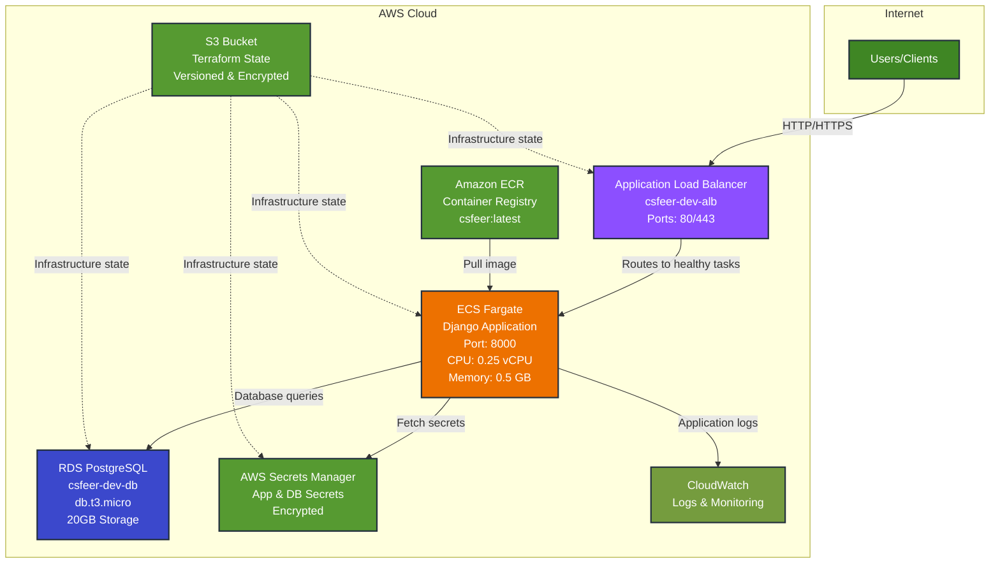

# CSFeer AWS Infrastructure - Big Picture

## Core Architecture



## Key Components

### 🚀 **ECS Fargate** (Main Application)
- **Service**: Runs Django application in containers
- **Scaling**: Auto-scalable, starts with 1 task
- **Resources**: 0.25 vCPU, 0.5 GB RAM per task
- **Health**: `/ready/` endpoint checks database connectivity

### 🏗️ **Application Load Balancer** (Traffic Router)
- **Purpose**: Routes HTTP/HTTPS traffic to healthy ECS tasks
- **Ports**: 80 (HTTP), 443 (HTTPS optional)
- **Health Checks**: Validates ECS task health
- **Location**: Public subnets with internet access

### 🗄️ **RDS PostgreSQL** (Database)
- **Instance**: db.t3.micro (free tier eligible)
- **Storage**: 20GB, encrypted, auto-scaling available
- **Location**: Private subnets (no direct internet access)
- **Backup**: Automated backups with configurable retention

### 📦 **ECR** (Container Registry)
- **Purpose**: Stores Docker images for the application
- **Tags**: `latest`, environment-specific, git commit SHAs
- **Security**: Integrated with IAM for access control

### 🪣 **S3** (State Storage)
- **Purpose**: Stores Terraform infrastructure state
- **Features**: Versioning, encryption, access logging
- **Files**: Separate state files for RDS, ECS, Keycloak components

### 📊 **CloudWatch** (Monitoring)
- **Logs**: Centralized application and infrastructure logs
- **Metrics**: CPU, memory, network utilization
- **Retention**: Configurable (7-30 days typical)

### 🔐 **AWS Secrets Manager** (Secure Configuration)
- **Purpose**: Stores sensitive configuration and credentials
- **Secrets**: Application secrets (Django SECRET_KEY, OIDC, API keys) and database credentials
- **Encryption**: Encrypted at rest using AWS KMS
- **Access**: ECS tasks fetch secrets on startup via IAM role

## Data Flow

1. **Startup**: ECS task fetches secrets from Secrets Manager
2. **User Request**: HTTP/HTTPS request hits ALB
3. **Load Balancing**: ALB routes to healthy ECS task
4. **Application**: Django app processes request, queries database
5. **Response**: Data flows back through ALB to user
6. **Logging**: All activity logged to CloudWatch

## Optional Components

- **Keycloak** (OIDC Authentication): Can be deployed for SSO
- **NAT Gateway**: Required if ECS tasks need internet access
- **Multi-AZ**: For high availability in production

## Cost Estimate (Dev Environment)

- **ECS Fargate**: ~$11/month
- **RDS PostgreSQL**: ~$17/month
- **Application Load Balancer**: ~$16/month
- **Secrets Manager**: ~$1/month (2 secrets)
- **Other** (ECR, CloudWatch, S3, data transfer): ~$6/month
- **Total**: ~$51/month

## Deployment

All infrastructure is deployed via Terraform using the deployment script:

```bash
./devops/iac/terraform/deploy-dev.sh
```

**Common Operations:**
- **Option 1**: Complete setup (RDS + ECS + health validation)
- **Option 5**: Deploy ECS/Fargate application
- **Option 10**: Deploy new code (rebuild container + redeploy)

## Additional Resources

- [AWS Secrets Manager Setup Guide](AWS_SECRETS_MANAGER_SETUP.md) - Detailed configuration and troubleshooting
- [Terraform Components](../iac/terraform/components/) - Infrastructure as code modules