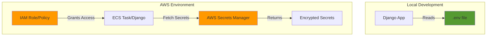

# AWS Secrets Manager Setup Guide

This guide explains how to set up and use AWS Secrets Manager for managing sensitive configuration in the CSFeer application.

## Overview

AWS Secrets Manager is used to securely store and retrieve sensitive configuration values such as:
- Django `SECRET_KEY`
- Database credentials (username, password, host)
- OIDC client secrets
- API keys
- Other sensitive configuration

### Local vs AWS Environments

- **Local Development**: Uses `.env` file and environment variables (Secrets Manager disabled)
- **AWS Environments** (dev/staging/prod): Uses AWS Secrets Manager for sensitive values

## Architecture



## Deployment

Secrets Manager is automatically configured when you deploy using the deployment script:

```bash
./devops/iac/terraform/deploy-dev.sh
# Select option 1 (Complete setup) or option 5 (Deploy ECS)
```

The deployment script will:
1. **Create secrets** in AWS Secrets Manager with generated values
2. **Configure IAM permissions** for ECS tasks to access secrets
3. **Update ECS task definition** with Secrets Manager environment variables
4. **Update CSRF_TRUSTED_ORIGINS** after ALB is created

### Manual Setup (Advanced)

If you need to create secrets manually or for a different environment:

#### Application Secrets

```bash
aws secretsmanager create-secret \
    --name csfeer-{environment}-secrets \
    --description "CSFeer application secrets" \
    --secret-string '{
        "SECRET_KEY": "your-django-secret-key-here",
        "OIDC_CLIENT_SECRET": "your-oidc-client-secret",
        "API_KEY": "your-api-key",
        "DEBUG": "false",
        "ALLOWED_HOSTS": "[\"*\"]",
        "CSRF_TRUSTED_ORIGINS": "[\"https://your-domain.com\"]"
    }'
```

#### Database Secrets

```bash
aws secretsmanager create-secret \
    --name csfeer-{environment}-db-credentials \
    --description "CSFeer database credentials" \
    --secret-string '{
        "username": "csfeer_admin",
        "password": "your-secure-password",
        "host": "csfeer-dev-db.xxxxx.us-east-1.rds.amazonaws.com",
        "port": 5432,
        "dbname": "csfeer"
    }'
```

## IAM Permissions

The Terraform configuration automatically grants the necessary IAM permissions. The ECS task role has:

- Permission to read secrets: `secretsmanager:GetSecretValue` and `secretsmanager:DescribeSecret`
- Access limited to specific secret ARNs

The IAM policy is defined in `devops/iac/terraform/components/csfeer-ecs/iam.tf`

## Usage

### Accessing Secrets in Code

The `AppConfig` class automatically loads secrets when `use_secrets_manager=true`:

```python
from csfeer.config import AppConfig

settings = AppConfig()

# These values will be loaded from Secrets Manager in AWS environments
print(settings.secret_key)  # From AWS Secrets Manager
print(settings.db_config.pgpassword)  # From AWS Secrets Manager
```

### Manual Secret Retrieval

For custom secrets not in the standard configuration:

```python
from csfeer.secrets_manager import SecretsManager, get_secret_or_env

# Direct usage
manager = SecretsManager(region_name="us-east-1")
api_key = manager.get_secret_value("csfeer-dev-secrets", "API_KEY")

# With fallback to environment variables (recommended)
api_key = get_secret_or_env(
    secret_name="csfeer-dev-secrets",
    env_var="API_KEY",
    key="API_KEY",
    default="fallback-value"
)
```

## Secret Schema

### Application Secrets (`csfeer-{env}-secrets`)

```json
{
    "SECRET_KEY": "django-secret-key-50-chars-minimum",
    "OIDC_CLIENT_SECRET": "oidc-client-secret-from-keycloak",
    "API_KEY": "your-api-key",
    "DEBUG": "false",
    "ALLOWED_HOSTS": "domain1.com,domain2.com",
    "CSRF_TRUSTED_ORIGINS": "https://domain1.com,https://domain2.com"
}
```

### Database Secrets (`csfeer-{env}-db-credentials`)

```json
{
    "username": "csfeer",
    "password": "secure-database-password",
    "host": "csfeer-dev-db.xxxxx.us-east-1.rds.amazonaws.com",
    "port": 5432,
    "dbname": "csfeer"
}
```

## Local Development

For local development, continue using `.env` file:

```bash
# .env file
USE_SECRETS_MANAGER=false
ENVIRONMENT=local
SECRET_KEY=your-local-dev-key
PGPASSWORD=secret123
OIDC_CONFIG__CLIENT_SECRET=local-oidc-secret
```

The application will automatically use `.env` values when `USE_SECRETS_MANAGER=false` or when running locally.

## Rotating Secrets

### Manual Rotation

```bash
# Update a secret
aws secretsmanager update-secret \
    --secret-id csfeer-dev-secrets \
    --secret-string '{
        "SECRET_KEY": "new-django-secret-key",
        "OIDC_CLIENT_SECRET": "new-oidc-secret",
        "API_KEY": "new-api-key"
    }'

# Restart ECS tasks to pick up new values
aws ecs update-service \
    --cluster csfeer-dev \
    --service csfeer-dev \
    --force-new-deployment
```

## Monitoring and Troubleshooting

### Check Secret Access in ECS Task

```bash
# Get task ARN
TASK_ARN=$(aws ecs list-tasks \
    --cluster csfeer-dev \
    --service-name csfeer-dev \
    --query 'taskArns[0]' \
    --output text)

# Execute command in container
aws ecs execute-command \
    --cluster csfeer-dev \
    --task $TASK_ARN \
    --container csfeer-app \
    --interactive \
    --command "/bin/sh"

# Inside container, check if secrets are loaded
python manage.py shell
>>> from csfeer.config import AppConfig
>>> settings = AppConfig()
>>> print(settings.use_secrets_manager)
>>> print(settings.aws_secret_name)
```

### Common Issues

#### 1. "Access Denied" Error

**Cause**: IAM role lacks permissions to access Secrets Manager.

**Solution**: Verify the ECS task role has the `secretsmanager:GetSecretValue` permission.

```bash
# Check IAM role permissions
aws iam get-role-policy \
    --role-name csfeer-ecs-task-role \
    --policy-name SecretsManagerAccess
```

#### 2. "Secret Not Found" Error

**Cause**: Secret name doesn't match or doesn't exist in the region.

**Solution**: Verify secret name and region:

```bash
# List secrets
aws secretsmanager list-secrets --region us-east-1

# Verify environment variables in ECS task
aws ecs describe-task-definition \
    --task-definition csfeer-dev-task \
    --query 'taskDefinition.containerDefinitions[0].environment'
```

#### 3. Application Still Using Default Values

**Cause**: `USE_SECRETS_MANAGER` is not set to `true` or secrets failed to load.

**Solution**: Check logs:

```bash
# View ECS task logs
aws logs tail /ecs/csfeer-dev --follow
```

Look for log messages like:
- `Fetching secret: csfeer-dev-secrets`
- `Failed to load application secrets from AWS: ...`

## Security Best Practices

1. **Use IAM Roles**: Never hardcode AWS credentials. Use ECS task roles.
2. **Least Privilege**: Grant only necessary permissions to specific secrets.
3. **Encryption**: Secrets Manager encrypts data at rest using AWS KMS.
4. **Audit**: Enable CloudTrail to log all secret access.
5. **Rotation**: Rotate secrets regularly, especially database passwords.
6. **Separate Environments**: Use different secrets for dev/staging/prod.

## Cost

AWS Secrets Manager pricing (as of 2024):
- $0.40 per secret per month
- $0.05 per 10,000 API calls

Estimated monthly cost for CSFeer:
- 2 secrets (app + db) = $0.80/month
- API calls (negligible for small scale)
- **Total: ~$1/month**

## References

- [AWS Secrets Manager Documentation](https://docs.aws.amazon.com/secretsmanager/)
- [ECS Task IAM Roles](https://docs.aws.amazon.com/AmazonECS/latest/developerguide/task-iam-roles.html)
- [Rotating Secrets](https://docs.aws.amazon.com/secretsmanager/latest/userguide/rotating-secrets.html)
