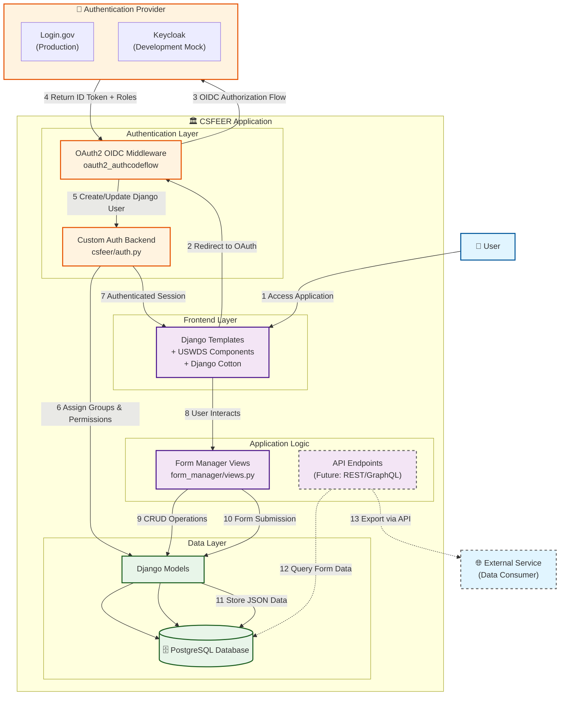

# CSFEER Application Architecture Overview

This document provides a high-level overview of the CSFEER (Community Services Form Engine) application architecture, focusing on user authentication via login.gov (Keycloak mock in development) and form data export capabilities.

## System Architecture Flow

